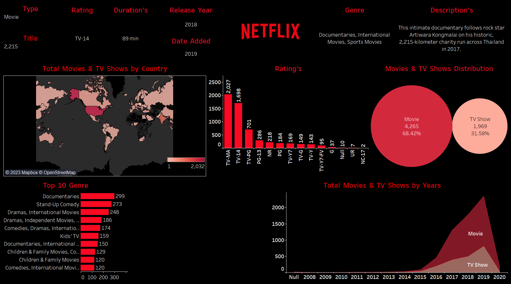

# Netflix-Dashboards

This repository contains the different files and information needed to create the tableau dashboards. Netflix uses Tableau Data Server so it can reuse its data sources and govern them across a wide range of users.

The goal of this project is to practice creating and interpreting different types of visualizations using real world data. With interactive dashboards that enable you to visualize your data, filter on demand and simply click to dig deeper into the underlying data—getting to insight isn't only fast, it's fun. Discover how easy it is and the impact you can make with real-time interactive dashboards from three Tableau customers.

There are many different solutions to help you build dashboards: Tableau, Excel, or Google Sheets.

